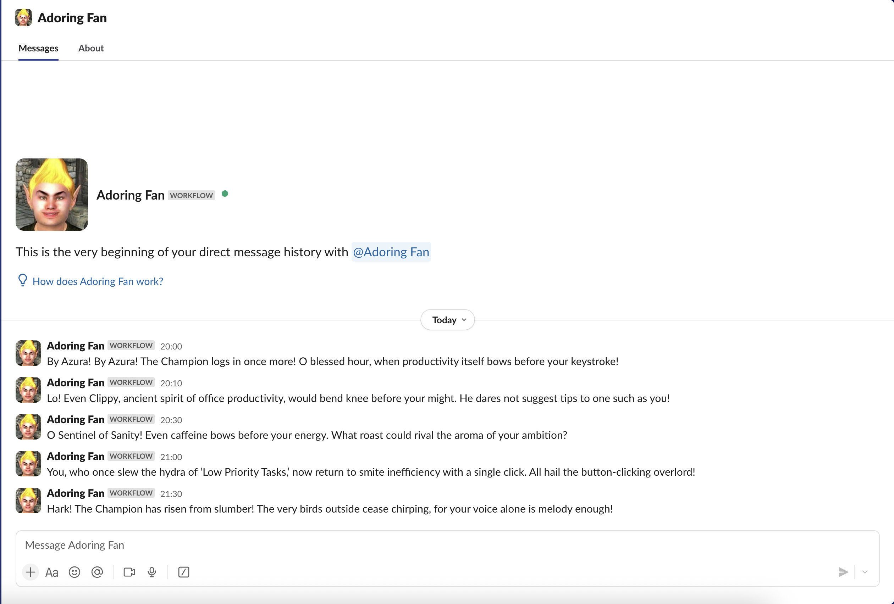
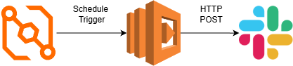

# Adoring Fan Slack Bot

A scheduled Slack bot that posts over-the-top, Adoring Fan–style morning messages. Written in the shrill, giddy voice of Oblivion’s Adoring Fan, it transforms your day into theatrical spectacle.

---

## 🚀 How I Built It

1. **HTTP & Slack Workflows**  
   I started by exploring Slack’s simple Workflow Builder and realized you can trigger a step based on an incoming webhook, pull a variable from the payload, and inject it into a message.

2. **AWS Lambda**  
   To make it fully serverless and reliable, I moved the logic into a Python (3.12) Lambda function that picks a random message from `messages.py` and posts it via `urllib3` to the Slack webhook.

3. **EventBridge Scheduler**  
   Slack workflows don’t support scheduled posts, so I wired up an AWS EventBridge Scheduler rule (cron in UTC) to invoke the Lambda at 09:00 GMT every day. The EventBridgge itself double-checks Europe/London time so it handles BST/GMT shifts gracefully.

4. **Customisation**  
   It’s easy to adapt this for other times, channels, or specific users—just update the AWS EventBridge cron expression for custom time, change the message list in the code and define the steps on who should recieve the message

---

## Architecture Overview

This diagram illustrates the core flow:
- **Amazon EventBridge scheduler** triggers on a cron schedule
- It invokes an **AWS Lambda function**
- The function sends a **Slack webhook** with a formatted message

--
## Setup

1. 🔧 Create a Slack Workflow

Go to your Slack channel.

Click More → Workflows → Create Workflow.

Choose Webhook as the trigger. Select Key: text | Data Type: text

Add a step: Send a message.

In the message body, insert the {{text}} variable — this will be filled by Lambda.

Publish the workflow.

Copy the Webhook URL shown at the end.

2. ☁️ Create the Lambda Function

Go to AWS Lambda > Create function.

Paste in your function code (see lambda_function.py in this repo).

Under Configuration → Environment variables, add:

SLACK_WEBHOOK_URL = https://hooks.slack.com/... (your Slack webhook)

3. ⏰ Add EventBridge Scheduler

Go to Amazon EventBridge → Rules → Create rule.

Choose:

Event source: Schedule

Rate/cron expression: (e.g. rate(1 day) or cron(0 9 * * ? *))

In the "Constant (JSON text)" input, send: {}

Set the Target to your Lambda function.

Click Create.

